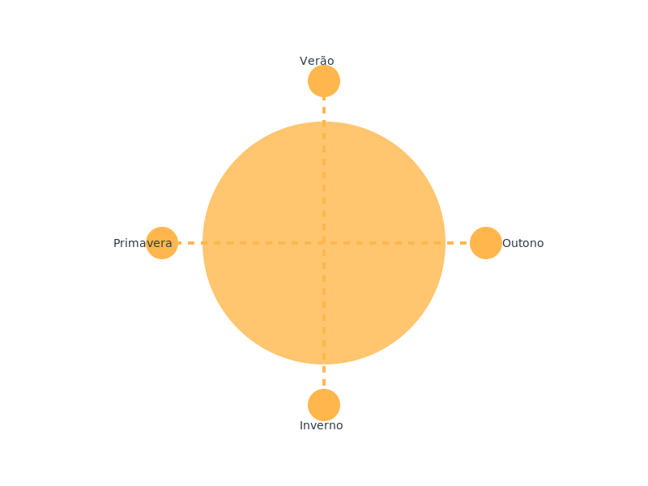

# 📅 Calendário Solar Israelita

*Um calendário baseado no ciclo solar e nas Escrituras Sagradas*

[Demonstração](https://calendario.netsarym.com.br) · [Reportar Bug](https://sanyahudesigner.com.br ) · [Solicitar Recurso](https://sanyahudesigner.com.br)

## ✨ Sobre o Projeto

O Calendário Solar Israelita é uma aplicação web moderna que oferece um método preciso e acessível para acompanhar os ciclos solares conforme descritos nas Escrituras Sagradas, Calendário de Enoque e Livro dos Jubileus. O projeto combina precisão astronômica com fundamentação bíblica, oferecendo uma ferramenta única para compreender os tempos determinados por YHWH (Deus).

### 🌟 Características Principais

- **Precisão Astronômica**: Cálculos exatos de solstícios e equinócios
- **Eventos Bíblicos**: Marcação de festivais e eventos históricos
- **Geolocalização**: Ajustes automáticos baseados na localização do usuário
- **Interface Moderna**: Design responsivo e intuitivo
- **Referências Bíblicas**: Fundamentação nas Escrituras Sagradas

## 🚀 Tecnologias Utilizadas

### Frontend
- React 18 com TypeScript
- React Router para navegação
- Axios para requisições HTTP
- CSS moderno e responsivo
- Vite como bundler

### Backend
- Python 3.11
- Django REST Framework
- MariaDB
- Cálculos astronômicos precisos
- API RESTful

## 🎯 Funcionalidades

- 📅 Visualização mensal do calendário
- 🌞 Cálculos de nascer e pôr do sol
- 🎊 Marcação de festivais e eventos
- 📖 Referências bíblicas detalhadas
- 📱 Design responsivo para todos os dispositivos

## 🌐 Demonstração

Este é um projeto de portfólio que demonstra minhas habilidades em desenvolvimento web fullstack. Você pode ver o projeto em funcionamento em:

[https://calendario.netsarym.com.br](https://calendario.netsarym.com.br)

### Principais Aspectos Técnicos

- Integração Frontend/Backend
- Cálculos astronômicos precisos
- Interface responsiva e moderna
- Otimização para SEO
- Performance e acessibilidade

## 👤 Autor

**Sanyahu Designer**
- Website: [Sanyahu Designer](https://sanyahudesigner.com.br)
- LinkedIn: [@sanyahu-designer](https://www.linkedin.com/in/sanyahu-designer/)
- GitHub: [@Sanyahu-Designer](https://github.com/Sanyahu-Designer)

## 🙏 Agradecimentos

- Inspirado nas Escrituras Sagradas
- Baseado em estudos do Calendário de Enoque e astronômicos
- Desenvolvido com foco na precisão e usabilidade

---

Desenvolvido com ❤️ por [Sanyahu Designer](https://sanyahudesigner.com.br)

